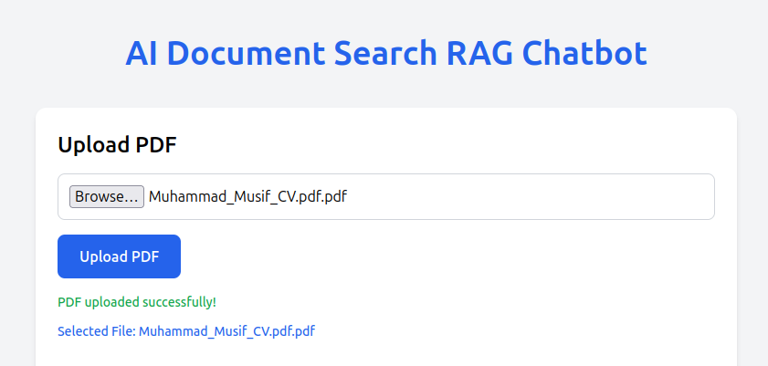
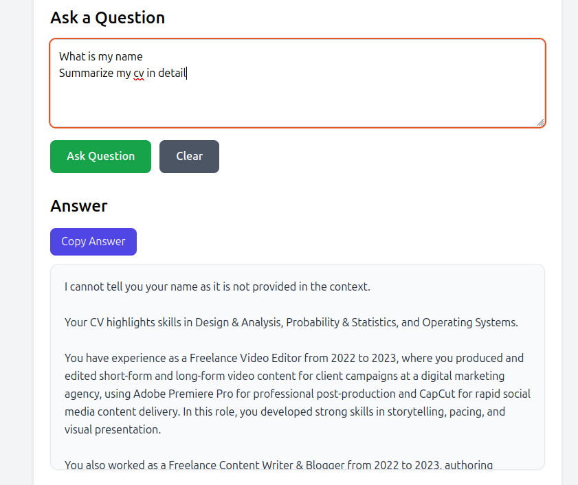
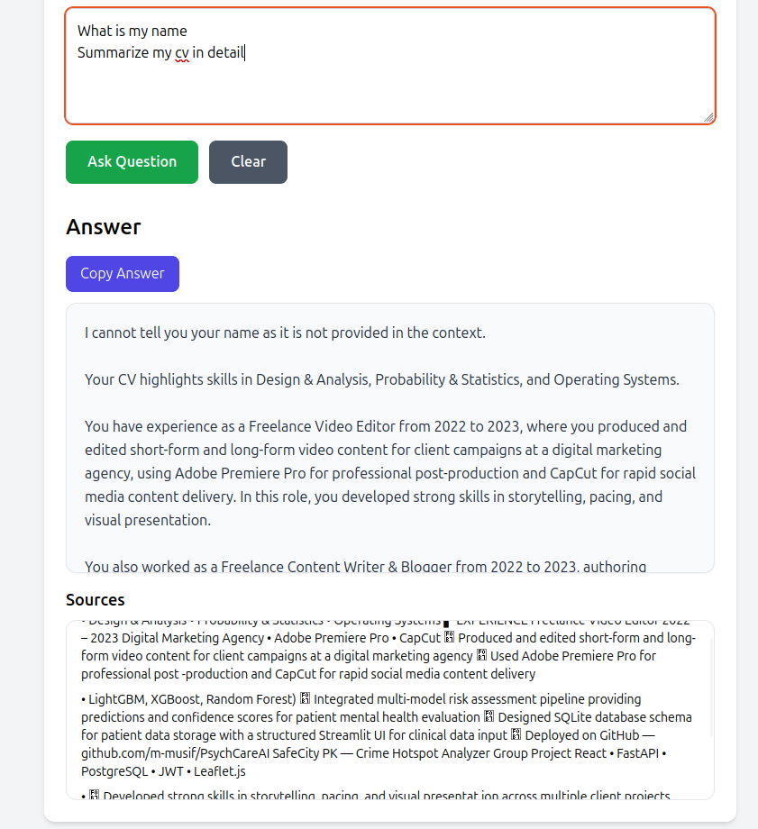

# AI Document Search RAG Chatbot

An AI-powered document search chatbot that allows users to upload PDF files and ask questions about their content. The system uses a Retrieval-Augmented Generation (RAG) pipeline with embeddings, FAISS vector search, FastAPI backend, and React frontend.

## Features

- Upload PDF documents
- Extract and process PDF text
- Split text into chunks
- Generate embeddings for semantic search
- Store and retrieve chunks using FAISS
- Ask natural language questions
- Generate AI-powered answers
- Display retrieved source chunks
- React + Tailwind frontend
- FastAPI backend API

## Tech Stack

### Frontend
- React
- Vite
- Tailwind CSS
- JavaScript

### Backend
- FastAPI
- Python
- FAISS
- Sentence Transformers
- RAG pipeline

## Project Structure

```text
AI-Document-Search-RAG-Chatbot/
├── backend/
├── frontend/
├── docs/
├── .env.example
├── .gitignore
└── README.md
## Screenshots

### Upload PDF



### Answer Generation



### Source References


